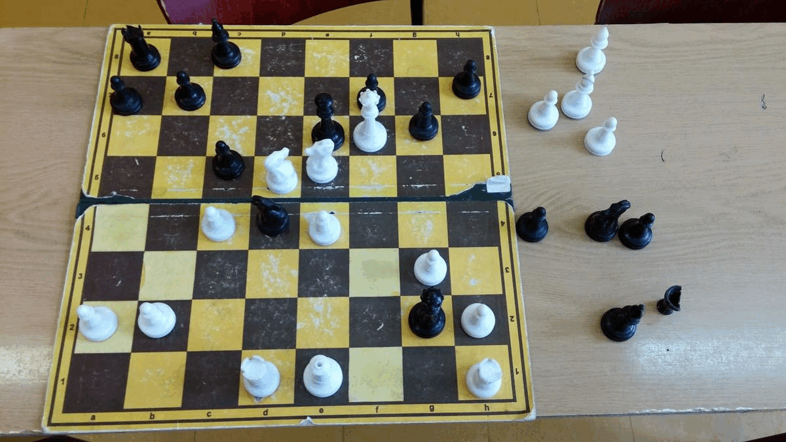

# ChessRecognition

## Work in Progress

## Setup
- install requirements from file
- create debug folder in the project
- update the config.yaml file with filepaths and data directories
- download models and data from [here](https://tubcloud.tu-berlin.de/s/ANxmJdgYGQ8rK3b)

__Dependencies:__

- [Python 3](https://www.python.org/downloads/)
- [OpenCV 2](http://opencv.org/)
- [Tensorflow](https://www.tensorflow.org/)

----

## Run main file
> python3 main.py testing_images/21.jpg -b'CPS' -m'MobileNetV2'

Arguments are:
    - b for choosing the board recognition algorithm, either 'Mine' or 'CPS'
    - m for choosing the Model e.g. 'MobileNetV2', 'NASNetMobile', 'InceptionResNetV2', or 'Xception'
    
Before utilising checking the model paths or giving a specific model path in the config is recommended
## Acknowledgements
- CPS from [Maciej A. Czyzewski's Algorithm](https://arxiv.org/abs/1708.03898)
- With improvements of [Quintana et al.](https://arxiv.org/abs/2012.06858)

## Workflow:

